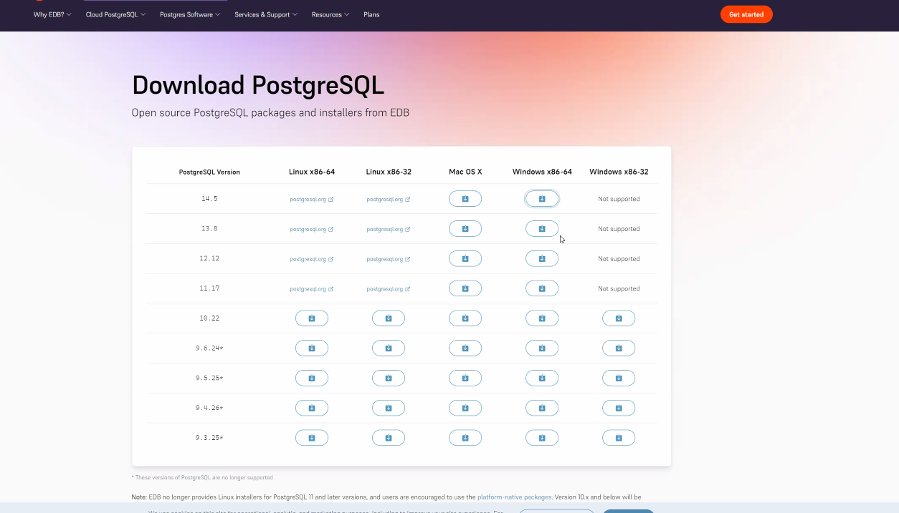
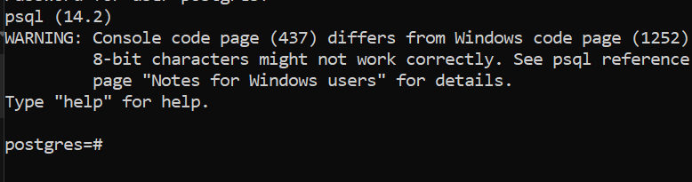

## Installing PostgreSQL
1. Navigate to this link: https://www.postgresql.org/download/. 
2. Pick your Operating System. 
3. Click on "Download the installer" 
4. You should see a page like this:

5. Click the download icon under Mac or Windows, version 14.
6. It should open the installer.
7. Installation directoy can be left the same, click next.
8. Keep all the components selected, click next.
9. Data directory, keep it default.
10. For password, make sure you remember it and write it down.
11. Keep the port default at 5432. 
12. Locale can be default.
13. It should give a summary of the installation details, click next. And then click next to start the installation. 
14. Once the install is done, it will prompt you to launche stack builder, we can check the box and click Finish.
## Stack Builder
- In the drop-down select PostgreSQL option
- Click on the Database Drivers and then check pgJDBC v42...
- Click on next
- Click next 2 more times
## Test out the Installation
- Open command prompt terminal
- Type "psql -U postgres"
- On Windows if you get a message that says "psql not recognized", you might have to change the path variable
- Otherwise, type in your password (it won't show up in the terminal)
- You should see something like this:

## Changing the path variable
- First, find the installation directory for PSQL
    - Go inside until you find the bin folder
    - Once in the bin folder, you can right-click the address and select "copy address as text"
    - The address should look something like C:\Program Files\PostgreSQL\14\bin
- Search for "Environment Variables" on Windows Search
- Click on "Edit the System Environment Variables"
- Click on Environment Variables
- Select the "Path" variable in the list of variables and values
- With Path selected, click on edit
- In this new window, click on "New" 
- Paste in the path to the bin folder
- Make sure you close out of command prompt before trying again

## Dbeaver
- Dbeaver is the platform we will use to connect to and run commands to our database:
- Go to this [link](https://dbeaver.io/download/) and select the Windows or Mac installer and follow the instructions

https://www.enterprisedb.com/docs/supported-open-source/postgresql/installer/02_installing_postgresql_with_the_graphical_installation_wizard/01_invoking_the_graphical_installer/
